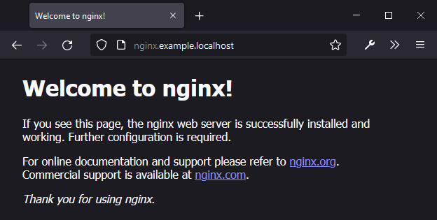
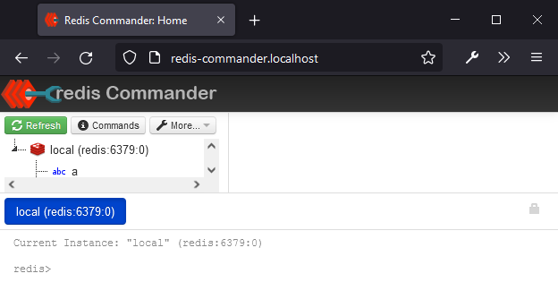

# System-wide containerized Traefik quick start

This repository introduces a guide and some tips on installing system-wide
containerized `traefik` instance with `docker-compose`.

## Features

- 📦 Preconfigured staging and production certificate resolvers (just change the E-Mail)
- 📄 Automatic certificate export from `acme.json` (without restart)
- ⚙️ Commonly used dynamic configurations (redirect to HTTPS, TLS version constraints)

## Table of Contents

1. [Installation](#installation)
1. [Usage](#usage)

## Installation

1. Clone this repository somewhere on your machine, i.e. home directory:

```bash
git clone https://github.com/lexuzieel/traefik-quick-start.git ~/traefik
```

2. Go to the newly created directory:

```bash
cd ~/traefik
```

3. Change ACME E-Mail to register your Let's Encrypt certificates:

```yaml
# traefik.yml

certificatesResolvers:
  production-resolver:
    acme:
      email: <your-email-here>
  staging-resolver:
    acme:
      email: <your-email-here>
```

<details>
  <summary>⚠️ Note on changing E-Mail later</summary>

> Your specified E-Mail will be used to register an account on the first usage by
> a [certificate resolver specified for a router](https://doc.traefik.io/traefik/routing/routers/#certresolver)
> and will be stored in `acme/acme.json`.
> If you will later want to change the E-Mail you will have to
> remove `acme.json` file. Since it is most likely that it will be created by 
> the container and will be owned by root, you will have to use `sudo`:
> ```
> sudo rm acme/acme.json
> ```

</details>

<details>
  <summary>🐛 Note on switching certificate resolvers</summary>

> There is currently a [bug with Traefik](https://github.com/traefik/traefik/issues/8633)
> that prevents switching between resolvers. If you have an already issued
> certificate by `staging-resolver` you first have to change your service's router
> [certresolver](https://doc.traefik.io/traefik/routing/routers/#certresolver)
> parameter to `production-resolver` and then **remove acme.json file**.

</details>

4. Bring up Traefik instance:

```bash
docker-compose up -d
```

This will create `traefik` docker-compose project with a single container
`traefik_reverse-proxy_1` that listens on ports 80, 443 and 8080 (dashboard) on
`127.0.0.1`.

5. Find your exported certificates

All generated certificates from `acme.json` are automatically exported as `*.crt` and `*.key` files
into `acme/exported/certs` and `acme/exported/private` respectively.

## Usage

<details>
  <summary>Single docker container</summary>

After bringing up an instance of `traefik`, it will 
[automatically watch](https://doc.traefik.io/traefik/getting-started/concepts/#auto-service-discovery) 
for new containers on your system. In order to tell `traefik` to create a 
route to your container, simply
[annotate it](https://doc.traefik.io/traefik/providers/docker):

```bash
docker run --rm \
-l 'traefik.enable=true' \
-l 'traefik.http.routers.nginx-example.rule=Host("nginx.example.localhost")' \
-l 'traefik.http.routers.nginx-example.entrypoints=web' \
-l 'traefik.http.services.nginx-example.loadbalancer.server.port=80' \
-l 'traefik.docker.network=traefik_overlay' \
--network traefik_overlay \
nginx
```

> Pay close attention to the `--network` parameter. In order for the Traefik to
> "see" this container they have to be connected to the same network, since
> originally containers reside in different networks and cannot access each
> other.

Now you can access your container at http://nginx.example.localhost:



</details>

<details>
  <summary>Docker-Compose service</summary>

Besides single containers you can also annotate `docker-compose` services and
since they are regular containers they will also be picked up by Traefik.

Given a `docker-compose.yml` file that descibes two services, a front-end and
a back-end:

```yaml
version: '3'

services:
  redis-commander:
    image: rediscommander/redis-commander:latest
    environment:
      - REDIS_HOSTS=local:redis:6379
    # This service is exposed by Traefik, so no need to expose the ports
    # ports:
    #   - "8081:8081"
    networks:
      - traefik
      # docker-compose project network
      # (to allow the backend to connect to redis)
      - default 
    labels:
      - "traefik.enable=true"
      - "traefik.http.services.redis-commander.loadbalancer.server.port=8081"
      - "traefik.http.routers.redis-commander.rule=Host(`redis-commander.localhost`)"
      - "traefik.http.routers.redis-commander.entrypoints=web"
      - "traefik.docker.network=traefik_overlay"
  redis:
    image: redis

networks:
  traefik:
    name: traefik_overlay
```

You can specify a reference to the `traefik_overlay` network in the list of
docker-compose project networks:

```yml
networks:
  traefik:
    name: traefik_overlay
```

Then, in the service that you want to expose, add this network:

```yml
services:
  my-service:
    ...
    networks:
      - traefik
      - default # <-- Add default network if you want to connect 
                # to other services inside the docker-compose project
```

Bring up this docker-compose project:

```bash
docker-compose --project-name example --file docker-compose.example.yml up -d
```

Now you can access your service at http://redis-commander.localhost:



<details>

## Configuration

This project has a sample `traefik.yml` configuration file that you can change
freely. In contrast to the official sample file, it has
`providers.docker.exposedByDefault` set to `false` by default.
Consult [configuration introduction](https://doc.traefik.io/traefik/getting-started/configuration-overview/)
page of Traefik documentation for more details.
